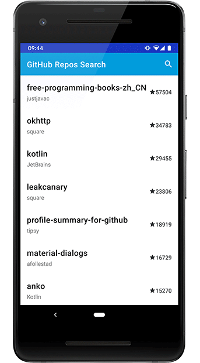

# GithubBrowserSample

Employment test. Android app that display's gitHub repositories sort by most starred descending.

- **Android Architecture Components**: AndroidX Lifecycles, LiveData, View Binding.
- **Rx programming**: RxKotlin, RxAndroid, Retrofit2.
- **Material Design**: Adaptive app icon, Swiperefreshlayout, Recyclerview, SearchView.
- Other: Koin dependency injection.

## Requirements

- MinSdk 21 (Android 5.0)

## Download

Check out the app <a href="https://github.com/P72B/GithubBrowserSample/raw/master/assets/app-release-1.0.0-1-0a48be.apk" download>Download</a>

